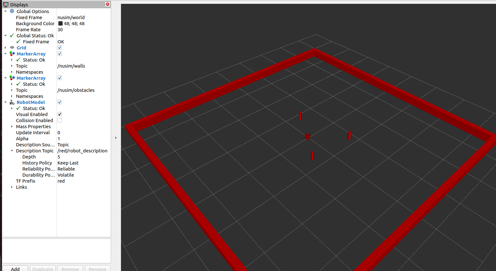

# nusim

The `nusim` package provides a simulated environment for the NuTurtle robot. It renders a walled rectangular arena, places configurable cylindrical obstacles, tracks the red (ground-truth) robot's pose, and publishes fake sensor data with realistic noise — all without requiring real hardware.

---

## What It Does

- Spawns a **red TurtleBot3** at a configurable starting pose
- Renders **arena walls** and **cylindrical obstacles** as RViz markers
- Simulates **wheel encoder ticks** in response to velocity commands
- Publishes a **fake LiDAR scan** with Gaussian noise and a limited sensing radius
- Broadcasts the `nusim/world → red/base_footprint` TF transform
- Exposes a **reset** service to return the robot to its initial pose
- Exposes a **teleport** service to jump the robot to any given pose

---

## Nodes

### `nusim`

The single node in this package. Runs a timer loop at a configurable rate to advance the simulation.

**Parameters**

| Parameter | Type | Default | Description |
|-----------|------|---------|-------------|
| `rate` | `int` | `200` | Simulation update rate (Hz) |
| `x0` | `double` | `0.0` | Initial robot X position (m) |
| `y0` | `double` | `0.0` | Initial robot Y position (m) |
| `theta0` | `double` | `0.0` | Initial robot heading (rad) |
| `obstacles.x` | `double[]` | `[]` | X coordinates of obstacles (m) |
| `obstacles.y` | `double[]` | `[]` | Y coordinates of obstacles (m) |
| `obstacles.r` | `double` | `0.038` | Obstacle cylinder radius (m) |
| `arena_x_length` | `double` | `5.0` | Arena inner length in X (m) |
| `arena_y_length` | `double` | `5.0` | Arena inner length in Y (m) |

**Published Topics**

| Topic | Message Type | Description |
|-------|-------------|-------------|
| `~/timestep` | `std_msgs/UInt64` | Current simulation timestep |
| `~/obstacles` | `visualization_msgs/MarkerArray` | Obstacle cylinders for RViz |
| `~/walls` | `visualization_msgs/MarkerArray` | Arena walls for RViz |
| `~/fake_sensor` | `visualization_msgs/MarkerArray` | Noisy landmark detections |
| `~/fake_lidar_scan` | `sensor_msgs/LaserScan` | Simulated LiDAR scan |
| `red/sensor_data` | `nuturtlebot_msgs/SensorData` | Simulated wheel encoder ticks |

**Subscribed Topics**

| Topic | Message Type | Description |
|-------|-------------|-------------|
| `red/wheel_cmd` | `nuturtlebot_msgs/WheelCommands` | Wheel velocity commands |

**Services**

| Service | Type | Description |
|---------|------|-------------|
| `~/reset` | `std_srvs/Empty` | Reset simulation to initial state |
| `~/teleport` | `nusim/Teleport` | Move robot to a specified pose |

---

## Launch Files

### `nusim.launch.xml`

Starts the full simulation environment.

```bash
ros2 launch nusim nusim.launch.xml
```

What it launches:
1. `nuturtle_description/load_one.launch.py` — loads the red TurtleBot3 URDF
2. `rviz2` — opens RViz with `nusim.rviz` configuration
3. `nusim` node — runs the simulation with `basic_world.yaml` settings

**Launch Arguments**

| Argument | Default | Description |
|----------|---------|-------------|
| `config_file` | `basic_world.yaml` | World configuration file |
| `rviz_config` | `nusim.rviz` | RViz configuration file |

---

## World Configuration

Edit `config/basic_world.yaml` to change the arena and obstacle layout:

```yaml
nusim:
  ros__parameters:
    rate: 200
    x0: 0.0
    y0: 0.0
    theta0: 0.0
    arena_x_length: 3.0
    arena_y_length: 3.0
    obstacles:
      x: [0.5, -0.5, 0.3]
      y: [0.5, -0.5, -0.8]
      r: 0.038
```

---

## Preview



---

## License

MIT License — Copyright (c) 2024 Kyaw Linn Khant
