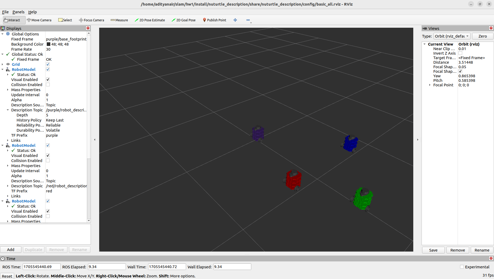

# nuturtle_description

This package contains the URDF/Xacro robot model for the NuTurtle (a TurtleBot3 Burger variant) along with RViz configurations for visualizing one or multiple robot instances simultaneously.

---

## Robot Model

The NuTurtle model (`turtlebot3_burger.urdf.xacro`) is parameterized by **color**, which lets multiple instances coexist in a single RViz session. This is used throughout the project to visualize the ground-truth robot (red), odometry estimate (blue), and SLAM estimate (green) side-by-side.

Available body colors: `red`, `green`, `blue`, `purple`

---

## Launch Files

### `load_one.launch.py` — Single robot

Spawns one robot with a configurable color, joint state publisher, and optional RViz visualization.

```bash
ros2 launch nuturtle_description load_one.launch.py
```

**Arguments**

| Argument | Default | Options | Description |
|----------|---------|---------|-------------|
| `color` | `red` | `red`, `green`, `blue`, `purple`, `""` | Robot body color |
| `use_jsp` | `gui` | `gui`, `jsp`, `none` | Joint state publisher mode |
| `use_rviz` | `true` | `true`, `false` | Launch RViz visualization |

`use_jsp` modes:
- `gui` — opens `joint_state_publisher_gui` (interactive sliders)
- `jsp` — runs headless `joint_state_publisher`
- `none` — no joint states published (used when another node handles this)

**Examples**

```bash
# Blue robot, no RViz (used internally by other packages)
ros2 launch nuturtle_description load_one.launch.py color:=blue use_rviz:=false use_jsp:=none

# Green robot with GUI
ros2 launch nuturtle_description load_one.launch.py color:=green use_jsp:=gui
```

---

### `load_all.launch.xml` — Four robots

Spawns all four color variants simultaneously. Useful for comparing pose estimates from different algorithms in a single RViz window.

```bash
ros2 launch nuturtle_description load_all.launch.xml
```

**Arguments**

| Argument | Default | Description |
|----------|---------|-------------|
| `use_jsp` | `gui` | Joint state publisher mode (shared across all robots) |
| `use_rviz` | `true` | Launch RViz with `basic_all.rviz` configuration |

---

## RViz Configurations

| File | Description |
|------|-------------|
| `config/basic_red.rviz` | Single red robot view |
| `config/basic_blue.rviz` | Single blue robot view |
| `config/basic_green.rviz` | Single green robot view |
| `config/basic_purple.rviz` | Single purple robot view |
| `config/basic_all.rviz` | All four robots simultaneously |
| `config/diff_params.yaml` | Differential drive physical parameters |

---

## Robot Parameters (`diff_params.yaml`)

Key physical parameters used throughout the project:

| Parameter | Value | Description |
|-----------|-------|-------------|
| `wheel_radius` | `0.033` m | Radius of each drive wheel |
| `track_width` | `0.160` m | Distance between left and right wheels |
| `motor_cmd_max` | `265` | Maximum wheel command value |
| `motor_cmd_per_rad_sec` | `0.024` | Motor command units per rad/s |
| `encoder_ticks_per_rad` | `651.9` | Encoder ticks per radian of wheel rotation |
| `collision_radius` | `0.11` m | Robot collision detection radius |

---

## Preview

Single robot in RViz:



ROS 2 node/topic graph with all four robots loaded:


---

## License

MIT License — Copyright (c) 2024 Kyaw Linn Khant
